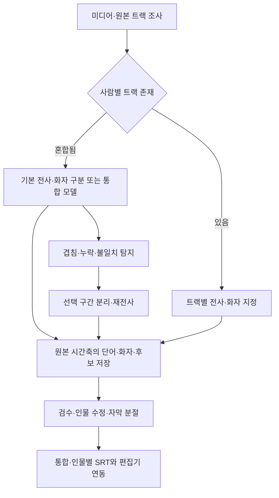

# VOICESUBSEP 대안 기술 및 개발 방식 심층 분석

조사 기준일: 2026-09-24

대상: 한국어를 우선 고려하는 인물별 자막 편집 도구. 사용자가 지정한 주 용도는 **동시 발화가 많은 예능·게임·토론**, 출력 대상은 여러 편집기다. 이번 작업은 공개 원문·모델 카드·소스·릴리스에 근거한 설계 분석이다. 모델 설치, 사용자 영상 업로드, 추론 벤치마크는 수행하지 않았다.

후속 구체화: 사용자는 **스트리머 편집, 대략 최대 4명**을 예상한다고 밝혔다. 또한 **일반 대화 / 동시 발화 처리 모드 전환**과 **화자 수 1·2·3·4명 선택**을 명시적으로 선택했다. 전사 모델 전환을 요구한 것으로 해석하지 않는다. 따라서 8명 초과·대규모 회의 지원보다 1~4인 대화, 겹침, 게임 효과음, 짧은 리액션, 긴 녹화의 부분 재처리를 우선한다. 노트 작업의 세부 의미는 미확정이며, 아래에는 타임코드 편집 메모를 제안한다.

이 문서는 PRODUCT-DESIGN.md의 후속 제안이다. 특정 모델 채택이나 기존 프로그램 포크를 확정하지 않는다.

## 1. 판단

처음 제안한 Whisper + Nemotron은 유효한 비교 기준이다. 그러나 동시 발화가 많은 자료에서는 화자 시간에 ASR 단어를 붙이는 것만으로 누락된 두 번째 사람의 대사를 복원할 수 없다. 이를 고려해 다음 방향을 권한다.

1. 녹음 단계에서 분리된 마이크·앱 트랙이 있다면 가장 먼저 활용한다.
2. 혼합 음성에는 기본 전사·화자 분리와 별도로 겹침 구간 복원 경로를 둔다.
3. ASR 후보에 Qwen3-ASR, 통합 전사 후보에 MOSS-Transcribe-Diarize를 추가해 같은 영상으로 비교한다.
4. 완성 앱 AutoSubs를 편집 작업 기준선으로 먼저 평가한다. 재사용할 수 있는 UI·편집기 연결과 별도로 추론 엔진을 설계한다.
5. 모델 점수보다 화자별 대사 누락과 실제 편집 시간 감소를 최종 선택 기준으로 삼는다.

이는 조사 결과에 기반한 설계 판단이며, 사용자의 영상에서 특정 모델이 더 우수하다는 실측 결론은 아니다.

## 2. 처음 설계에서 달라져야 할 부분

| 기존 제안 | 보완 제안 | 이유 |
| --- | --- | --- |
| 분석용 16 kHz 모노 생성 | 먼저 원본 트랙·채널을 조사하고 분리 여부를 선택 | 사람별 원본 정보와 공간 정보를 성급하게 없애지 않기 위해 |
| Whisper를 기본 품질 모델로 가정 | Whisper, Qwen3, MOSS를 실제 자료로 비교 | 한국어·장르·겹침에서 우열이 달라질 수 있음 |
| 겹침은 표시하고 수동 교정 | 표시 + 해당 구간만 분리·재전사 후보 생성 | 원래 ASR에서 누락된 대사를 되찾을 경로 필요 |
| Nemotron 결과에 단어를 연결 | 통합 전사 모델의 결과도 같은 프로젝트 형식으로 수용 | 독립 모델 사이의 시간 연결 오류를 줄일 가능성 |
| 새 편집 UI와 연동 개발 | AutoSubs 기반 활용과 독립 개발을 함께 평가 | 이미 구현된 작업을 반복하는 비용을 줄임 |
| DER·CER·시간 오차 평가 | 겹침 구간 화자별 누락 + 수정 시간까지 평가 | 사용자가 체감하는 결과와 모델 단일 점수는 다름 |

## 3. 서로 다른 다섯 문제

| 문제 | 실제 출력 | 해결하지 못하는 것 |
| --- | --- | --- |
| 전사 ASR | 무슨 말을 했는지 | 말한 사람이 누구인지 자동 보장하지 않음 |
| 화자 구분 diarization | 누가 언제 활동했는지 | 겹친 두 사람의 음성과 대사 복원 |
| 강제 정렬 alignment | 주어진 대사의 시간 | 틀리거나 누락된 대사의 정정 |
| 음성 분리·목표 화자 추출 | 사람별로 추정한 음성 | 추출된 음성이 원음을 완벽하게 보존한다는 보장 |
| 자막 편집·배치 | 읽을 수 있는 길이와 화면 배치 | 앞 단계의 내용 오류 자동 해결 |

NVIDIA도 diarization과 speaker-attributed ASR을 구별하고, 예제의 시간 중간점 연결이 겹친 대사를 분리하지 못한다고 명시한다. [NVIDIA Nemotron 설명](https://huggingface.co/blog/nvidia/nemotron-diarization)

## 4. 실제 비교할 핵심 후보

| 후보 | 장점과 근거 | 남은 문제 | 권고 |
| --- | --- | --- | --- |
| faster-whisper large-v3 + Nemotron | 단어 시간과 화자 활동을 분리해 검사·교체 가능 | 겹친 대사 누락, 두 시간축의 연결 오류 | 최초 기준선 |
| Qwen3-ASR-1.7B + 정렬 + Nemotron | 한국어 ASR와 한국어 강제 정렬의 공식 지원 | 한국어 예능에서 Whisper보다 좋다는 직접 증거는 없음 | 우선 비교 |
| MOSS-Transcribe-Diarize 0.9B | 대사·화자·시간을 한 번에 생성, 자막 웹 앱 제공 | 한국어 겹침의 실측, 출력 누락·화자 안정성·세밀한 시간 검증 필요 | 우선 비교 |
| ASR + pyannote Community-1 | 인원 수 제약 설정, 일반·exclusive 화자 결과 함께 제공 | exclusive만 쓰면 동시 발화 정보가 단순화됨 | 화자 엔진 대조군 |
| VibeVoice-ASR | 대사·화자·시간 통합, 한국어 평가 공개 | 기본 대형 모델 자원 부담, 사용자 자료에서 겹침 복원 검증 필요 | 후순위 실험 |

기본 API와 기능은 각각의 원문에서 확인했다. [faster-whisper](https://github.com/SYSTRAN/faster-whisper), [Nemotron 모델 카드](https://huggingface.co/nvidia/Nemotron-3-Diarization), [Qwen3-ASR](https://github.com/QwenLM/Qwen3-ASR), [MOSS 모델 카드](https://huggingface.co/OpenMOSS-Team/MOSS-Transcribe-Diarize), [Community-1](https://huggingface.co/pyannote/speaker-diarization-community-1), [VibeVoice](https://github.com/microsoft/VibeVoice)

### 4.1 Qwen3: Whisper 외에 반드시 비교할 후보

Qwen3-ASR-0.6B/1.7B와 Qwen3-ForcedAligner-0.6B는 한국어를 공식 지원한다. 공식 보고서는 한국어 CER을 공개한다. 이는 단순히 언어 목록에 한국어가 있다는 것보다 강한 근거지만, 사용자의 예능·게임 음성과 같은 시험은 아니다.

| 한국어 평가셋 | Qwen3-ASR 0.6B CER | Qwen3-ASR 1.7B CER |
| --- | ---: | ---: |
| Common Voice | 8.48% | 5.88% |
| MLC-SLM | 10.31% | 8.61% |
| FLEURS | 3.72% | 2.57% |

이 표에는 동일 조건의 한국어 Whisper 값이 함께 제시되지 않으므로, 이를 Whisper 대비 개선율로 바꿔 말하면 안 된다. 출처는 보고서 부록 A.2다. [Qwen3-ASR 기술 보고서](https://arxiv.org/html/2601.21337v2)

정렬도 독립 비교 대상이다. Qwen 정렬기의 기본 시간 예측은 80 ms 구간을 사용한다. 후처리 보간으로 더 세밀한 숫자를 출력하더라도 그 자체가 프레임 수준의 음향 정확도를 증명하지 않는다. WhisperX 한국어 정렬과 비교하고 사람이 경계를 움직일 수 있게 한다. [정렬기 구현](https://raw.githubusercontent.com/QwenLM/Qwen3-ASR/main/qwen_asr/inference/qwen3_forced_aligner.py)

### 4.2 MOSS: 여러 모델을 이어 붙이는 방식의 유력 대안

MOSS-Transcribe-Diarize는 2026-07-09 공개된 0.9B 모델이며, 익명 화자 라벨·시간·대사를 함께 생성한다. 공식 모델 카드는 한국어가 포함된 14개 언어 챌린지 성과와 50개 이상 언어 지원을 안내한다. 소스에는 검수, JSON/SRT/ASS 출력용 웹 앱도 있다. [공식 모델 카드](https://huggingface.co/OpenMOSS-Team/MOSS-Transcribe-Diarize), [공식 구현](https://github.com/OpenMOSS/MOSS-Transcribe-Diarize)

설계상의 이점은 ASR와 화자 결과를 나중에 억지로 연결하는 오류를 줄일 가능성이다. 반면 출력이 일관되어 보여도 대사 누락, 잘못된 화자, 잘못 생성된 시간은 생길 수 있다. 독립적인 음성 활동·겹침 검출을 함께 남겨 확인할 수 있어야 한다.

공식 최대 90분 입력 주장은 모델의 지원 범위다. RTX 3080 Ti 12GB에서 90분 파일을 한 번에 안정적으로 처리한다는 실측 근거는 확인하지 않았다. 첫 평가는 짧은 구간부터 진행하고 긴 파일에서 메모리·출력 토큰 제한·화자 유지 여부를 별도로 본다.

MOSS-Transcribe-Diarize와 아래 MossFormer2는 이름이 비슷하지만 서로 다른 프로젝트이며 역할도 다르다.

### 4.3 pyannote: Nemotron의 대체·검증 엔진

Community-1은 `num_speakers` 또는 `min_speakers`/`max_speakers`를 설정할 수 있고, 겹침을 포함한 일반 화자 구분과 `exclusive_speaker_diarization`을 함께 제공한다. exclusive는 ASR 시간 연결을 단순하게 하기 위한 투영으로 사용한다. 원래의 겹침 구간은 따로 보존해야 한다. Nemotron처럼 문서화된 고정 8개 출력 채널 제한을 갖는 구조와는 다르지만, 그렇다고 무제한 인원의 정확도를 보장하지는 않는다. [Community-1 모델 카드](https://huggingface.co/pyannote/speaker-diarization-community-1)

예능에서는 출연자 외 내레이션, 게임 캐릭터, 삽입 영상까지 포함하면 화자가 늘어난다. 자동으로 8명 이하라고 가정하지 말고 입력 범위와 포함할 음성 유형을 보여 줄 필요가 있다.

이번 사용자 범위에서는 주 참가자 1~4명을 기본값으로 둔다. 게임 캐릭터·삽입 영상 음성을 억지로 네 참가자 중 한 명에게 배정하지 않고, 제외 또는 기타 음성으로 검수할 수 있게 한다. 4명은 예상 사용 범위이지 모든 파일에서 정확히 4명이 말한다는 강제 조건이 아니다.

Nemotron의 대표 VoiceArena DER 결과는 영어 자료에 대한 것이며, pyannote의 다른 데이터셋 표와 숫자만 직접 비교해 한국어 승자를 정할 수 없다. 데이터, 겹침 포함 여부, 경계 허용 오차, 오디오 길이와 화자 수를 맞춰야 한다. [NVIDIA 평가 설명](https://huggingface.co/blog/nvidia/nemotron-diarization)

### 4.4 후순위 후보를 구별해야 하는 이유

VibeVoice-ASR는 통합 전사를 제공하지만, 공식 모델 카드상 전체 약 9B/BF16이므로 가중치만 단순 계산해도 약 18GB다. 이는 실행 측정이 아닌 크기 계산이며, 12GB에 그대로 적재하는 기본안에는 맞지 않는다. 공식 BitNet 경량판도 있지만 품질·화자 출력·메모리 검증을 별도로 해야 한다. 실시간 변형이 오프라인 예능 자막에서 자동으로 우수한 것은 아니다. [VibeVoice 모델 카드](https://huggingface.co/microsoft/VibeVoice-ASR), [BitNet 모델 카드](https://huggingface.co/microsoft/VibeVoice-ASR-BitNet)

NVIDIA Parakeet-TDT-0.6B-v3와 Canary-1B-v2의 해당 언어 목록에 한국어는 없다. 반면 Nemotron-3.5-ASR-Streaming-0.6b는 한국어를 지원한다. NVIDIA ASR 전체가 한국어를 지원하지 않는다고 일반화하면 안 된다. 다만 이번 요구는 녹화 편집이므로 저지연 스트리밍을 먼저 최적화할 이유는 약하다. [Parakeet v3](https://huggingface.co/nvidia/parakeet-tdt-0.6b-v3), [Canary v2](https://huggingface.co/nvidia/canary-1b-v2), [Nemotron 3.5 ASR](https://huggingface.co/nvidia/nemotron-3.5-asr-streaming-0.6b)

2026년 9월의 Qwen-Audio-3.0-ASR와 Qwen3-ASR-1.7B는 같은 공개 모델의 단순 버전 변경으로 취급하지 않는다. 전자는 별도 서비스·연구 경로로 확인되며, 이 설계에서는 실제 사용할 수 있는 공개 가중치 경로가 확인된 Qwen3를 기준 후보로 삼는다. [Qwen-Audio-3.0 프로젝트](https://qwenaudio.github.io/qwen-audio-3.0-asr/)

## 5. 동시 발화를 다루는 더 나은 방식

### A. 녹음 단계의 분리 — 가능하면 최우선

원래부터 사람별 마이크가 분리되어 있으면, 그 트랙의 화자를 지정하고 각 트랙을 전사한 뒤 시간축에서 합칠 수 있다. 이 경우 혼합 음성에서 사람을 추정하는 부담이 크게 줄어드는 것이 설계상 이점이다. 누음, 에코, 중복 수음, 장치별 시계 오차는 여전히 확인해야 한다.

게임 녹화에서는 OBS로 내 마이크·게임·통화 앱을 별도 트랙에 기록할 수 있다. 단, **Discord 앱 트랙 하나를 분리해도 그 안에서 이미 섞인 참가자들까지 각각 분리되는 것은 아니다.** 사람별 트랙이 필요하면 참가자별 녹음 또는 이를 지원하는 별도 녹음 경로가 있어야 한다. [OBS 다중 트랙 녹화](https://obsproject.com/kb/multiple-audio-track-recording-guide), [앱별 오디오 캡처](https://obsproject.com/kb/application-audio-capture-guide)

### B. 혼합 음성 — 겹침 구간만 선택 복원

권장하는 처리 순서는 다음과 같다.

1. 원본에서 기본 전사와 화자 활동을 계산한다.
2. 겹침, 전사 누락 의심, 모델 간 불일치 구간을 찾는다.
3. 문제 구간에 앞뒤 문맥을 붙여 별도 분석한다.
4. 음성 분리 또는 사용자가 지정한 화자의 참조 음성으로 목표 화자를 추출한다.
5. 분리된 각 음성을 재전사하고 원본 시간축으로 돌린다.
6. 앞뒤 깨끗한 발화와 대조해 화자를 연결하고, 원본·복원 결과를 함께 들려준다.

ASR가 아예 놓친 대사에는 낮은 신뢰도 단어조차 존재하지 않는다. 따라서 'ASR 점수가 낮은 단어만 재검사'해서는 안 되고, 음성 활동과 전사 구간의 불일치도 검수 조건에 포함해야 한다. 겹침 검출 역시 완벽하지 않으므로 무작위 표본 검수와 사용자의 구간 지정 기능을 남긴다.

분리 결과의 출력 채널 1이 다음 구간에서도 같은 사람이라는 보장은 없다. 사람별 원본 참조·음성 특징·앞뒤 문맥을 이용해 다시 연결하고 애매한 경우 사용자 확인을 받는다.

### C. 음성 분리 후보

| 후보 | 확인한 역할 | 적용 판단 |
| --- | --- | --- |
| ClearerVoice / MossFormer2_SS_16K | 16 kHz 음성 분리의 공개 모델과 실행 인터페이스 | 짧은 겹침 구간의 우선 실험 후보 |
| SpeechBrain SepFormer | LibriMix/WSJ 혼합 음성 등으로 학습된 분리 모델 | 재현 가능한 비교 기준, 모델별 인원·샘플률 제한 확인 |
| WeSep | 참조 음성을 이용한 목표 화자 추출 | 사용자가 깨끗한 대표 발화를 지정하는 후속 기능 후보 |
| SAM Audio | 텍스트·시각·시간 단서 기반 음원 분리 | 다양한 효과음 환경의 후순위 실험 |
| Tencent AuK | 생성 방식의 오디오 편집·목표 음성 추출 | 원문 보존과 자원 검증 전에는 자막의 기본 증거로 사용하지 않음 |

공식 공개 기능을 확인한 출처: [ClearerVoice 사용법](https://github.com/modelscope/ClearerVoice-Studio/blob/main/clearvoice/README.md), [MossFormer2 모델](https://huggingface.co/alibabasglab/MossFormer2_SS_16K), [SepFormer](https://huggingface.co/speechbrain/sepformer-libri2mix), [WeSep](https://github.com/wenet-e2e/WeSep), [SAM Audio](https://github.com/facebookresearch/sam-audio), [AuK](https://github.com/Tencent-Hunyuan/AuK)

이 후보들의 공개 결과를 한국어 고함·웃음·3인 이상 동시 발화의 정확도나 이 PC의 메모리 사용량으로 대체할 수 없다. 분리된 소리가 더 깨끗하게 들리더라도 자음·작은 목소리가 손실되면 자막은 더 나빠질 수 있다. 평가 목표는 청감 점수만이 아니라 대사 누락과 문자 오류다.

배경음 제거, 사람 간 음성 분리, 실명 식별은 다른 기능이다. 음악의 보컬을 추출하는 모델을 사람 A/B의 음성 분리 모델로 취급하지 않는다. 모든 파일을 일괄 정제하지 말고 원본 경로와 비교한다.

얼굴·입 움직임을 이용하는 방식도 있으나 게임 화면, 화면 밖 발화, 리액션 컷, 더빙에서는 대응 관계가 깨진다. 첫 버전의 필수 입력으로 삼지 않는다. ClearerVoice의 준비된 AV 추출 기능과 학습용 audio-only TSE 코드를 동일한 완성 기능으로 취급해서도 안 된다. [ClearerVoice 프로젝트 구성](https://github.com/modelscope/ClearerVoice-Studio)

## 6. 기존 프로그램을 활용하는 대안

### AutoSubs: 가장 먼저 실제 사용 기준선으로 볼 후보

공식 v3.10.1 릴리스와 해당 태그의 README에서 Windows, 인물·자막 편집, SRT 출력, Resolve·Premiere·After Effects 연동을 확인했다. 애플리케이션 코드는 MIT다. 이는 우리가 제안한 기능 상당 부분이 이미 구현된 프로젝트라는 뜻이다. [v3.10.1 릴리스](https://github.com/tmoroney/auto-subs/releases/tag/v3.10.1), [해당 버전 README](https://raw.githubusercontent.com/tmoroney/auto-subs/v3.10.1/README.md)

그러나 그대로 채택하기 전에 두 가지를 확인해야 한다.

- 해당 버전의 오디오 전처리에는 `-ar 16000 -ac 1`과 채널 평균 처리가 있다. 유용한 원본 분리 채널을 유지하는 입력 경로가 필요하다. [태그 고정 전처리 소스](https://raw.githubusercontent.com/tmoroney/auto-subs/v3.10.1/AutoSubs-App/src-tauri/src/audio_preprocess.rs)
- 선택 기능인 MMS 강제 정렬 가중치는 앱의 MIT 라이선스와 별도로 CC BY-NC 4.0이라고 문서에 명시되어 있다. 코드와 모델을 같은 라이선스로 간주하지 않는다. [라이선스 설명](https://github.com/tmoroney/auto-subs#model-licensing)

또한 화자 라벨 지원은 겹친 두 대사를 모두 복원한다는 증거가 아니다. 공개 설명의 별점, 언어 수, RAM 추정치를 한국어 자막 완성도 점수로 쓰지 않는다.

권장 의사결정:

| 개발 경로 | 적합한 경우 | 먼저 확인할 점 |
| --- | --- | --- |
| AutoSubs 사용 + 별도 분석 엔진 | 원하는 자막 편집·내보내기가 충분함 | 프로젝트/JSON 연결과 수정 보존 가능 여부 |
| AutoSubs 포크·확장 | 기존 UI·편집기 연동은 맞고 겹침 검수만 부족함 | 추론 엔진 교체 범위, 업데이트 유지 비용 |
| 독립 VOICESUBSEP 앱 | 겹침 복원·다중 트랙·검수 작업이 기존 UI에 맞지 않음 | 독자 개발할 기능의 사용자 이득 |

아직 소스 전체 영향 분석이나 실제 설치 사용을 하지 않았으므로 '간단히 모델만 교체하면 된다'고 단정하지 않는다.

### 다른 기존 도구

Buzz v1.4.5는 로컬 전사·화자 식별·재생·수정과 SRT/VTT 출력을 제공하는 비교 후보다. 다만 화자 이름을 자막 문구에 붙이는 것과 인물별 편집 트랙을 만드는 것은 구별해야 한다. Subtitle Edit는 자막 분절·싱크 조절·형식 변환·ASR 연동 등 후처리의 기준선으로 볼 가치가 있다. [Buzz 릴리스](https://github.com/chidiwilliams/buzz/releases/tag/v1.4.5), [Subtitle Edit 기능 문서](https://subtitleedit.github.io/subtitleedit/features/speech-to-text.html)

### 클라우드를 허용할 경우의 비교 후보

로컬 실행은 현재 제안일 뿐 사용자가 확정한 필수 조건은 아니다. 클라우드도 선택지로 비교하되 파일 외부 전송과 지속적인 사용 비용을 제품 선택에 포함한다. 이번 조사에서는 서비스 호출·파일 전송을 하지 않았다.

| 후보 | 자막 편집에 유용한 기능 | 제약과 판단 |
| --- | --- | --- |
| ElevenLabs Scribe v2 | 한국어, 단어별 시간·화자 ID, 최대 32명 | 데이터 형식상 우선 비교 후보. 한국어 겹침 누락은 직접 측정해야 함 |
| Azure fast transcription | 한국어, 단어·구간 시간, 화자 라벨, 독립 stereo 처리 | 화자 구분과 독립 2채널 처리의 동시 설정 제약 확인 |
| OpenAI gpt-4o-transcribe-diarize | 구간별 화자·시간·대사, 알려진 화자의 참조 음성 | 해당 모델은 단어별 timestamp 옵션 미지원, 세밀한 자막은 추가 정렬 필요 |

공식 근거: [Scribe 기능](https://elevenlabs.io/docs/overview/capabilities/speech-to-text), [Azure fast transcription](https://learn.microsoft.com/en-us/azure/ai-services/speech-service/fast-transcription-create), [Azure 언어 지원](https://learn.microsoft.com/en-us/azure/ai-services/speech-service/language-support), [OpenAI 전사 가이드](https://developers.openai.com/api/docs/guides/speech-to-text)

Scribe의 `no_verbatim`처럼 머뭇거림·반복을 정리하는 기능은 예능 편집 소재를 없앨 수 있으므로 원문 유지가 기본인 편이 맞다. Scribe의 다채널 모드는 이미 나뉜 채널을 전사하는 기능이며 혼합 음성을 사람별로 분리하는 기능이 아니다. [Scribe API](https://elevenlabs.io/docs/api-reference/speech-to-text/convert), [다채널 설명](https://elevenlabs.io/docs/eleven-api/guides/how-to/speech-to-text/batch/multichannel-transcription)

상용 화자 분리만 사용할 경우 pyannote Precision도 후보이나 ASR 엔진은 별도 필요하다. 현재 문서는 Precision-3 전환을 안내하므로 예전 Precision-2 소개만 보고 신규 연동 모델을 고정하지 않는다. [현행 모델 안내](https://docs.pyannote.ai/models)

## 7. 추천하는 수정 구조

이는 논리적인 병렬 경로이며 GPU 모델을 모두 동시에 올리라는 뜻은 아니다. RTX 3080 Ti 12GB에서는 우선 단일 작업 큐와 모델 순차 적재로 최대 메모리를 측정한다.

구현 시 중요한 조건:

- 입력 파일, 원본 트랙, 분석용 오디오, 정제·분리 파생 음성의 출처를 연결한다.
- ASR는 화자별로 지나치게 짧게 자르기 전에 문맥을 보존해 수행한다. 짧은 '네', '아니', 고함을 누락시키는 후처리를 피한다.
- 원문 단어, 모델의 화자·시간 제안, 사람이 고친 자막, 화면 표시용 축약 문구를 분리해 저장한다.
- 재분석 결과를 기존 자막 위에 바로 덮어쓰지 않는다. 사용자가 확정한 인물과 문구는 유지한다.
- 프로젝트의 인물 ID와 모델의 익명 채널 ID를 분리한다. 부분 재분석·파일 변경 시 모델 ID가 바뀔 수 있다.
- 긴 영상을 임의로 나누었다면 구간 오프셋, 중복 문맥 제거, 구간 간 인물 연결을 처리한다.
- 게임 NPC, 영상 내 내레이션, 삽입 클립의 목소리도 검출될 수 있으므로 포함·제외를 사용자가 선택할 수 있게 한다.
- '모두 받아쓰기'와 '화면에 읽기 좋게 표시'는 별도 단계로 둔다. 리액션이나 겹친 짧은 말을 화면에서 숨겨도 원문을 삭제하지 않는다.

언어 모델은 띄어쓰기·전문용어·문장 분절 후보를 제안하는 데 쓸 수 있다. 대화 문맥만 보고 화자를 확정하거나 들리지 않은 대사를 보충하게 하지 않는다. 언어 정보로 화자 오류를 줄이는 연구는 있으나 특정 영어 전화 자료의 결과를 한국어 예능에 일반화할 수 없다. [Lexical Speaker Error Correction 연구](https://arxiv.org/abs/2306.09313)

## 8. 여러 편집기로 가져가는 방법

SRT는 공통 타이밍·텍스트 출력으로 유지한다. 인물 색상, 그래픽 레이어, 다중 자막 동시 표시까지 모든 편집기에서 보존되는 포맷으로 취급하지 않는다.

예를 들어 Final Cut Pro의 공식 검증 문서는 SRT의 시간 겹침을 오류로 다룬다. 호환 출력은 겹친 대사를 한 cue 안의 복수 대사로 합성하는 방식이 필요할 수 있다. 내부 프로젝트에서는 두 인물의 원래 시간과 독립 자막을 그대로 보존한다. [Final Cut 자막 검증](https://support.apple.com/en-ph/101629)

- 통합 SRT: 이름 접두어와 겹침 표시 정책을 선택한다.
- 인물별 SRT: 시간은 원본 기준으로 유지하고 다른 인물의 구간은 비워 둔다.
- 프로젝트 JSON: 원문, 후보 화자, 검수 상태, 시간과 수정 이력을 보존한다.
- 편집기 전용 연결: 자막 트랙 또는 그래픽 텍스트 레이어로 변환한다. 앱별 동작을 실제 가져오기·재편집으로 검증한다.

AutoSubs는 Premiere의 캡션 트랙과 After Effects의 텍스트 레이어를 구별해 문서화한다. 내부 자막 객체를 유지하고 내보내기 어댑터를 두는 설계가 적합하다. [AutoSubs 연동 설명](https://github.com/tmoroney/auto-subs#quick-start)

OpenTimelineIO는 편집 시간축 연결의 후보지만, 모든 편집기의 자막·스타일 왕복을 자동 보장하지 않는다. 지원은 포맷별 어댑터에 달려 있다. 우선 컷 편집이 끝난 영상으로 시작하고, 원본 기반 편집 추적은 별도 기능으로 평가한다. [OTIO 어댑터 문서](https://opentimelineio.readthedocs.io/en/latest/tutorials/adapters.html)

## 9. 공개 수치보다 중요한 자체 비교 실험

### 1단계: 작게 실패 유형을 확인

총 15분 안팎의 예비 자료를 구성한다. 아래 길이는 운영 제안이며 결과 수치가 아니다.

- 또렷한 2인 대화: 기본 전사와 화자 연결.
- 게임 소리·음악이 있는 대화: 비대사와 참가자 음성 구별.
- 2~3인 동시 발화와 짧은 맞장구: 누락·중복·화자 혼동.

첫 실행은 아래 세 계열을 같은 원본으로 비교한다.

| 실행 | 구성 | 검증 질문 |
| --- | --- | --- |
| A | Whisper large-v3 + Nemotron | 최초 제안의 실제 기준선 |
| B | Qwen3-ASR-1.7B + 한국어 정렬 + Nemotron | ASR·정렬 변경의 효과 |
| C | MOSS-Transcribe-Diarize | 통합 모델이 최종 화자별 자막에 유리한가 |

화자 오류가 주요 원인이면 같은 ASR 출력을 고정하고 Nemotron/Community-1을 비교한다. 타이밍이 원인이면 같은 대사를 고정하고 정렬기만 바꾼다. 누락이 원인이면 같은 겹침 구간에서 분리 전·후를 비교한다. 모든 모델 조합을 한 번에 늘리지 않는다.

### 2단계: 선택 후보를 실제 편집으로 평가

예비 결과를 보고 60~90분 정도의 서로 다른 실제 자료로 확대한다. 임계값을 정하는 자료와 최종 평가 자료를 분리하고, 같은 출연자·같은 영상 조각이 양쪽에 반복되어 일반화 성능을 과장하지 않게 한다.

| 지표 | 보는 것 |
| --- | --- |
| 한국어 CER | 글자 기준 대사 정확도. 띄어쓰기·숫자 표기 정규화 기준 공개 |
| 화자별 문자/단어 오류 | 대사가 맞아도 다른 사람에게 배정된 오류 포함 |
| 겹침 구간의 누락·중복 | 작은 목소리, 두 번째 발화, 같은 대사의 복제 여부 |
| 화자 DER | 발화 검출·화자 구분. 겹침 포함과 경계 허용 오차 명시 |
| 자막 시작·끝 오차 | 평균과 큰 오차 구간, 수동으로 고쳐야 하는 비율 |
| 사람의 수정 시간 | 영상 10분당 최종 자막 완성에 든 실제 시간 |
| 운영 지표 | 첫 실행·재실행 시간, 최대 VRAM, 중단·재개, 파일 크기 |

화자별 전사 평가는 cpWER/tcpWER 같은 통합 지표가 도움이 된다. 한국어에 문자 단위를 사용할 경우 토큰화 정책을 명시하고, 서로 다른 방식으로 계산한 숫자를 직접 비교하지 않는다. 시간 제약을 두면 전혀 다른 시각의 같은 말을 잘못 맞춰 점수가 좋아지는 문제를 줄일 수 있다. [MeetEval](https://github.com/fgnt/meeteval), [tcpWER 설명](https://raw.githubusercontent.com/fgnt/meeteval/main/doc/tcpwer.md)

편집 시간 비교는 기존 도구 결과와 후보 결과의 순서를 번갈아 사용하고 같은 사람이 이미 답을 외운 영향도 고려한다. '30% 절감' 같은 목표를 정할 수는 있지만 측정 전에는 성과로 쓰지 않는다.

## 10. 개발 우선순위 제안

### 사용자 선택을 반영한 제품 설정

| 설정 | 사용자가 선택한 범위 | 제안 동작 |
| --- | --- | --- |
| 대화 모드 | 일반 대화 / 동시 발화가 많은 대화 | 일반은 기본 전사·화자 배정, 동시 발화는 겹침 구간 검수·분리·재전사 경로를 우선 제공 |
| 화자 수 | 1명 / 2명 / 3명 / 4명 | 참가자 수를 사용자가 지정하고 이름·색상을 연결 |
| 주 작업 | 스트리머 영상 편집 | 게임·통화·마이크 트랙 보존, 효과음·리액션·기타 음성 검수 |
| 노트 | 기능 요청 있음, 세부 의미 미확정 | 아래 타임코드 편집 메모 방식을 제안 |

일반 모드에서도 겹침 정보를 버리지 않는다. 모드를 바꿀 때 원본·사람 이름·수동 자막 수정은 보존하고 필요한 분석 단계만 추가 실행하는 구조를 제안한다. 동시 발화 모드는 정확도가 검증된 별도 모델이라는 뜻이 아니라 추가 검수·복원 절차를 사용하는 제품 설정이다.

화자 수 설정은 엔진별로 적용 방식이 다르다. 개수를 직접 받는 엔진에는 해당 제약을 전달한다. Nemotron의 고정 출력 채널을 임의로 잘라 내거나 추가 화자를 네 참가자에 강제 병합하지 않는다. 예상 인원과 다르면 기타 음성·중복 인물 후보로 검수한다. '인물 4명' 선택이 4명이라는 정답을 새로 만들어 주는 것은 아니다.

노트 기능의 제안 형태:

- 현재 재생 시각 또는 선택 구간에 메모를 붙인다.
- 컷 편집, 하이라이트·쇼츠 후보, 자막 수정, 음성 확인 태그를 둔다.
- 노트를 클릭하면 원본 구간으로 이동하고 구간을 반복 재생한다.
- 자막을 다시 생성해도 유지되도록 노트를 자막 순번이 아닌 원본 파일 ID·시작·종료 시각에 연결한다.
- 노트는 프로젝트에 저장하고 Markdown/CSV로 내보낸다. AI의 요약·추천은 사용자 메모와 구별한다.

### 실행 순서

1. **기준선 확인:** AutoSubs의 현재 릴리스를 실제 자료로 평가하고 필요한 검수 동작을 정한다.
2. **엔진 비교:** 위 A/B/C를 같은 프로젝트 출력 형식으로 비교한다.
3. **겹침 복원 실험:** 짧은 겹침 구간의 원본과 분리·재전사 결과를 나란히 듣고 고친다.
4. **제품 형태 결정:** 기존 앱 확장과 독립 앱 중 실제 편집 흐름에 맞는 쪽을 선택한다.
5. **편집기 검증:** 최소 두 편집기에서 한글·시간·겹침·이름·수정 가능 여부를 확인한다.

첫 제품에서 우선할 차별점은 '새 모델을 넣었다'보다 **인물별 겹침 대사를 되찾고, 잘못된 결과를 적은 조작으로 고치는 기능**이다. 실시간 처리, 얼굴 자동 대응, 화려한 자막 생성은 그 이후에 판단한다.

## 11. 확인된 범위와 남은 불확실성

공식 문서와 소스로 확인한 것은 기능·지원 언어·출력 형태·일부 제약과 릴리스 존재다. 사용자 영상의 품질, 이 PC의 처리 속도·최대 메모리, NLE 설치 환경의 실제 연동은 확인하지 않았다.

지금 가장 우선할 선택은 특정 모델의 최종 확정이 아니라 **원본 트랙 보존 + 교체 가능한 기본 엔진 + 겹침 구간 재분석 + 수정 이력 보존**이라는 구조다. 이 구조에서 비교하면 더 나은 모델이 나오거나 장르가 바뀌어도 앱 전체를 다시 만들 필요를 줄일 수 있다.
