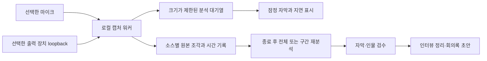

# 라이브 캡처와 인터뷰·회의록 확장 제안

상태: **설계 제안, 미구현**. 조사일: 2026-09-24.

Windows의 마이크와 컴퓨터 출력 소리를 각각 보존하고, 녹음 중에는 수정될 수 있는 자막을 보여주며, 종료 후 원본으로 정밀 재분석하는 구성을 권장한다. 인터뷰 정리·회의록은 그 결과를 이용하는 별도 생성 단계다. 현재의 `Note`는 타임코드 편집 메모이며, 기존 노트 요청을 자동 회의록 생성에 대한 동의로 해석하지 않는다. 인터뷰·회의록 생성과 라이브 입력·출력 캡처는 이번에 추가된 기능 제안이다. 이 문서는 해당 기능의 구현·녹음 시작·모델 설치를 실행하지 않는다.

## 확인한 플랫폼 제약

| 경로 | 공식 문서에서 확인한 사실 | 설계에 반영할 점 |
| --- | --- | --- |
| Windows 출력 | WASAPI loopback은 렌더링 장치에서 재생되는 소리를 캡처한다. `eRender`와 `AUDCLNT_STREAMFLAGS_LOOPBACK`을 사용하며 shared mode에서만 동작한다. 별도 Stereo Mix 장치 활성화는 필수가 아니다. | 선택한 출력 장치의 혼합음을 하나의 소스로 취급한다. 통화 상대, 게임, 알림이 이미 섞여 있을 수 있다. |
| Windows 입력 | WASAPI의 캡처 장치를 열고 `IAudioCaptureClient`로 가변 크기의 오디오 패킷을 읽어 보관할 수 있다. | 마이크를 출력 캡처와 별도 스트림·파일로 관리한다. |
| 브라우저 공유 | `getDisplayMedia()`는 영상 트랙이 필요하며 `video:false`는 오류다. `audio:true`와 `systemAudio:"include"`도 오디오 트랙을 보장하지 않는다. 지원은 브라우저·OS·선택한 공유 대상에 좌우된다. 보안 컨텍스트, 사용자 동작, 매번의 공유 허가가 요구된다. | 브라우저에서 임의의 컴퓨터 소리를 항상 녹음할 수 있다고 표시하지 않는다. 실제 오디오 트랙 존재 여부를 확인하고, 없으면 캡처 실패를 설명한다. |

출력 경로의 근거는 [Microsoft WASAPI Loopback Recording](https://learn.microsoft.com/en-us/windows/win32/coreaudio/loopback-recording), 입력 경로는 [Microsoft Capturing a Stream](https://learn.microsoft.com/en-us/windows/win32/coreaudio/capturing-a-stream), 브라우저 제약은 [MDN getDisplayMedia](https://developer.mozilla.org/en-US/docs/Web/API/MediaDevices/getDisplayMedia)다. 아래의 구조·단계·수용 조건은 이 프로젝트를 위한 설계 판단이며, 문서가 성능을 보장하는 것은 아니다.

Windows 장치를 명시적으로 선택하고 입력·출력을 함께 안정적으로 보존하려는 목표에는 **로컬 네이티브 캡처 워커**가 필요하다. 기존 React 화면과 로컬 Python API를 유지하면서 WASAPI에 접근하는 워커를 추가하는 안이다. 구현 언어와 WASAPI 래퍼는 설치·장치 테스트 후 결정한다. 브라우저만 사용하는 공유 캡처는 지원되는 조합에서의 제한적 대안으로 둔다. 출력 장치 단위 캡처가 특정 앱만의 녹음이나 통화 참가자별 원본 분리를 제공하는 것은 아니다.

## 녹음과 추론을 분리한 흐름

소리 수집과 디스크 기록은 ASR 처리와 별도 실행 경로로 둔다. ASR가 늦어져도 원본 기록을 막지 않는다. 메모리 대기열이 차면 잠정 분석 작업을 합치거나 건너뛰고 화면에 지연을 표시한다. 녹음이 끝나면 저장된 원본으로 누락된 분석 구간을 채운다. 디스크 부족이나 기록 실패는 분석 지연과 구분해 즉시 알리고, 원본을 저장하지 못하면서 정상 녹음 중으로 표시하지 않는다.

첫 범위는 마이크 1개와 출력 장치 1개다. 녹음 시점에 두 신호를 섞지 않고 각 소스의 샘플률·채널·순서를 보존한다. 분석용 16 kHz 모노 변환, 동기화된 미리 듣기, 필요시 혼합본은 파생 파일로만 만든다. 원본은 원래 장치가 전달한 PCM이며, 장치나 OS에서 이미 처리된 소리를 처리 이전 상태로 복원한다는 뜻은 아니다.

파일은 일정 길이 조각으로 안전하게 확정하고 별도 세션 명세에 연결한다. 명세에는 세션 ID, 소스 ID와 장치 표시명, 포맷, 조각 순서, 시작 시각, 샘플 수, 중단·누락 사건을 기록한다. 중간 종료 후에도 확정된 조각을 복구할 수 있게 한다. 저장 용량은 선택 포맷으로 계산해 녹음 전에 보여준다.

## 공통 시간과 인물의 의미

마이크와 출력 장치의 시간축을 단순히 두 파일의 0초로 맞추지 않는다. 캡처 시작 오프셋과 각 장치의 샘플 진행을 공통 단조 시계에 대응시키고, 조각마다 원본 샘플 위치에서 세션 시각으로 변환하는 정보를 보관한다. 장시간 녹음의 드리프트는 이 대응 관계로 추정하고 **분석용 복사본에 점진적 리샘플링**을 적용하는 안이다. 측정한 장치 지연과 시계 오차를 구분하며, 드리프트 허용치는 아래 수용 시험으로 검증한다.

무음, 장치 분리, 재연결, 패킷 누락을 같은 사건으로 취급하지 않는다. 누락은 알려진 공백으로 표시하고 시간이 줄어들도록 이어 붙이지 않는다. 장치나 포맷이 바뀌면 새 구간으로 기록한다. 시간 불연속을 안정적으로 보정하지 못하면 해당 구간을 검수 대상으로 남긴다.

`마이크`와 `컴퓨터 소리`는 **녹음 소스**, `인물 A`와 `인물 B`는 **발화자**다. 하나의 마이크를 여러 사람이 공유하거나 출력에 여러 참가자가 섞일 수 있으므로 소스 ID를 인물 ID로 자동 치환하지 않는다. 참가자 이름은 사용자 배정 또는 검수 결과로 붙인다. 마이크에 스피커 재생음이 다시 들어오는 중복도 고려한다. 헤드폰 사용 안내와 파생 신호의 중복·에코 검사를 검토하되 원본을 삭제하지 않는다. 이미 혼합된 출력의 동시 발화는 별도의 분리 문제로 남는다.

## 현재 오프라인 파이프라인에 연결하기

현재 `analyze()`는 완성된 파일의 선택 오디오 스트림을 전사하고, 선택하면 Nemotron 화자 구분을 순차 실행하는 배치 인터페이스다. 입력 콜백, 라이브 세션, 잠정 결과 수정 프로토콜은 없다. Nemotron 내부를 청크 단위로 실행한다고 현재 앱이 실시간 서비스를 제공하는 것은 아니다. 실제 확인 범위는 영어 합성 음성의 CPU tiny smoke이며, 한국어 실시간 지연이나 장시간 화자 안정성은 아직 측정하지 않았다.

녹음 중 자막은 짧은 구간과 앞뒤 문맥을 이용해 주기적으로 갱신하는 **잠정 전사**로 시작한다. 청크 간 중복 단어와 문장 수정을 처리하는 별도 상태 관리가 필요하며, 기존 `analyze()`를 매번 호출해 모델을 계속 다시 로드하는 구조는 피한다. 잠정 자막에는 세션·소스·구간 ID, 버전, 잠정 상태를 붙인다. 실시간 인물 표시는 별도 검증 전까지 미지정 또는 임시 인물로 표현하고, 청크마다 붙은 인물 번호가 동일인을 뜻한다고 가정하지 않는다.

종료 후에는 소스별 원본과 공통 시간 매핑을 사용해 전사·화자 구분을 다시 실행한다. 현재 인터페이스의 재사용에는 각 소스의 결과를 세션 시간으로 옮기는 어댑터가 필요하다. 소스 사이 같은 목소리의 중복과 인물 대응은 추가 검수 대상이다. 동시에 말한 내용을 단순한 시간 순서로 합쳐 한 사람에게 배정하지 않는다. 예상 인원 1~4명은 설정값이며 초과 인물을 억지로 합치지 않는다.

실시간과 정밀 분석이 GPU를 동시에 점유하도록 강제하지 않는다. 기존 단일 추론 워커 정책을 확장해 우선순위와 모델 생명주기를 관리하고, 녹음 자체는 계속 진행한다. 12 GB GPU에서의 실제 지연·메모리를 측정하기 전에는 특정 모델의 실시간 동작을 보장하지 않는다. 종료 후 결과는 비교 가능한 새 분석 버전으로 저장하고 사용자 검수·메모를 덮어쓰지 않는다.

## 인터뷰 정리와 회의록

자막 검수 후 별도 버튼으로 다음 초안을 생성하는 안이다. 녹음을 시작하거나 편집 노트를 추가했다는 이유로 자동 생성하지 않는다.

| 산출물 | 제안 내용 | 근거 표시 |
| --- | --- | --- |
| 인터뷰 정리 | 질문·답변 묶음, 주제별 요약, 인용 후보 | 인물과 원본 시작·종료 시각. 직접 인용과 요약을 구분 |
| 회의록 | 논의 항목, 명시적 결정, 할 일, 보류 사항 | 각 항목에서 근거 자막·음성으로 이동. 담당자·기한이 언급되지 않으면 미정 |
| 편집 노트 | 사용자가 작성한 메모·하이라이트 | 기존 타임코드 메모 유지. 생성 초안과 별도 저장 |

LLM 사용은 추가 의존성이며 현재 구현에 포함되지 않는다. 우선 로컬 생성 경로를 검토하고 외부 서비스에 원문을 자동 전송하지 않는다. 전사·화자·겹침이 불확실하면 초안에도 미확정 표시를 유지한다. 재분석으로 근거 문장이 바뀌면 관련 항목을 오래된 초안으로 표시한다. 실제 발언에 없는 합의·담당자·기한을 채워 넣는 결과는 수용하지 않는다.

기존 프로젝트 스키마의 `notes`를 회의록으로 재사용하지 않는다. 캡처 세션, 여러 소스의 상대 시간, 분석 버전, 생성 초안과 근거 연결을 추가할 스키마 확장이 필요하다. v1 프로젝트를 계속 열 수 있는 이전 절차를 설계한 뒤 적용한다.

## 사용 흐름과 녹음 표시

사용자가 입력·출력 장치와 저장 위치를 확인하고 **녹음 시작**을 눌렀을 때만 기록한다. 설정 화면의 레벨 확인도 사용자가 켜는 테스트로 두고 종료 방법을 제공한다. 출력 캡처 범위에 통화 외 소리도 포함될 수 있음을 선택 화면에 표시한다.

녹음 중에는 상태 표시, 경과 시간, 소스별 레벨과 저장 상태, **녹음 중지**를 계속 보여준다. 최소화 상태에서도 녹음 상태와 중지 동작에 접근할 수 있는 표시를 둔다. 첫 구현은 화면 제어 연결이 끊기거나 앱이 종료되면 기록을 중지하고 저장을 마무리하는 정책을 권장한다. 무인 재시작이나 숨은 자동 녹음은 범위에 넣지 않는다.

중지는 수집 핸들을 닫고 현재 조각을 확정한 뒤 종료를 알린다. 분석 취소와 녹음 중지는 별도 동작이다. 장치 연결 해제 시 다른 마이크로 몰래 전환하지 않고 해당 소스 중단을 알린다. 계속 녹음되는 다른 소스가 있다면 그 상태도 분명하게 표시한다.

## 제안 단계와 수용 조건

아래는 구현 완료 후 확인할 **목표 조건이며 현재 통과 결과가 아니다**.

| 단계 | 구현 범위 | 수용 조건 |
| --- | --- | --- |
| 1. 원본 캡처 | Windows 장치 선택, 입력·출력 별도 기록, 시작·중지, 복구 | 마이크만/출력만/동시 기록 파일을 각각 재생할 수 있고 소스가 섞이지 않는다. 시작 전·중지 후에는 추가 샘플을 기록하지 않는다. 장치 분리·디스크 부족·강제 종료에서 오류와 보존된 범위를 확인한다. |
| 2. 공통 시간 | 시간 매핑, 드리프트 처리, 종료 후 분석 어댑터 | 두 경로에 알려진 시각의 테스트 신호를 보내 시작·중간·끝을 비교한다. 60분 시험에서 분석용 시간 정렬 오차 50 ms 이하를 초기 목표로 삼고 실제 결과를 기록한다. ASR 경계 정확도와 별도로 측정한다. 누락 구간은 시간축에 그대로 남는다. |
| 3. 잠정 자막 | 주기적 전사, 상태 수정, 지연 표시 | 기준 PC·모델·한국어 자료를 고정해 발화 종료 후 표시 지연의 p50/p95와 수정 횟수를 기록한다. p95 5초 이내를 초기 목표로 검토하되 녹음 무손실이 우선이다. 부하 초과 시 지연을 알리고 종료 후 분석으로 복구한다. |
| 4. 인터뷰·회의록 | 근거 연결 초안, 사용자 검수, 내보내기 | 모든 결정·할 일·인용 항목에 원문 근거가 있거나 미확정 표시가 있다. 담당자·기한의 누락을 임의 보완하지 않는다. 원문 이동과 편집 메모 보존을 확인한다. |

모든 단계에서 실제 한국어 인터뷰와 1~4인 겹침 대화 자료를 별도로 평가해야 한다. 겹침 대사의 누락·중복·화자 오배정을 세어 기록하고, 단위 테스트 통과를 의미 품질이나 실제 녹음 안정성의 증거로 대신하지 않는다. 초기 범위 밖은 앱별 자동 캡처, 참가자별 원격 원본 수집, 라이브 음원 분리, 자동 외부 공유다.
