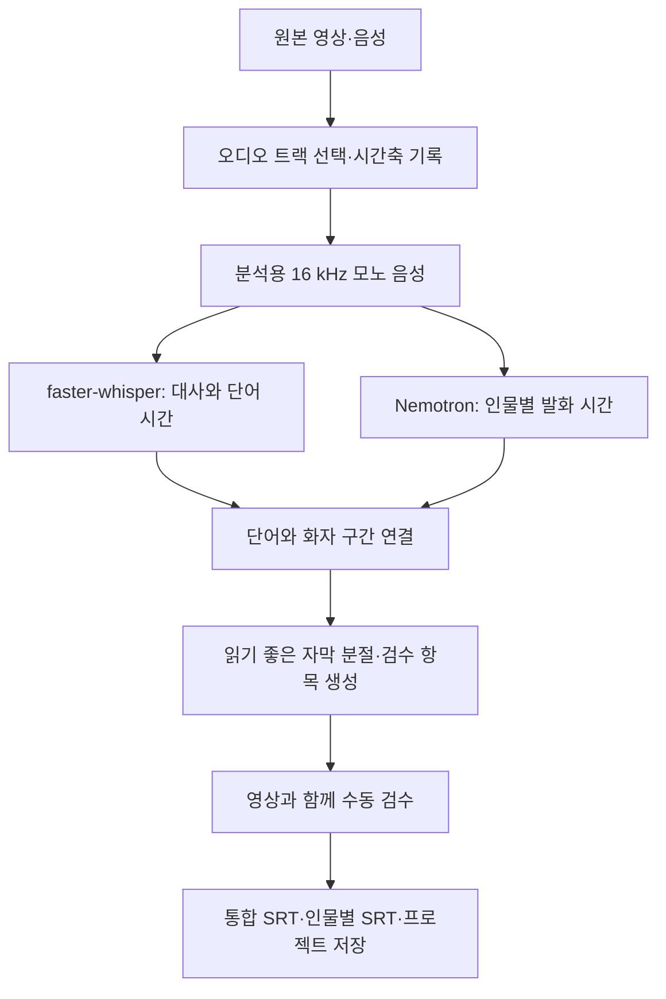

# VOICESUBSEP — 인물별 자막 편집 도구 설계 초안

작성일: 2026-09-24 · 상태: 기능·구조 제안, 구현 및 실제 영상 검증 전

후속 분석: 사용자가 동시 발화가 많은 예능·게임·토론을 주 용도로 지정했다. [대안 기술 심층 분석](ALTERNATIVES-ANALYSIS.md)은 원본 트랙 보존, 겹침 구간 복원, Qwen3/MOSS 비교, 기존 앱 활용을 추가 제안한다. 아래 문서는 최초 설계 기준선으로 보존한다.

추가 확인: 실제 주 용도는 스트리머 편집이며 예상 참가자는 대략 최대 4명이다. 이후 범위 선정은 이 조건을 우선한다.

사용자가 선택한 설정은 일반 대화 / 동시 발화 모드 전환 및 화자 수 1·2·3·4명 선택이다. 이는 Whisper/Qwen 전사 모델 전환 요구와 다르다. 노트 기능은 세부 확인 전이며, 후속 분석에서 타임코드 편집 메모를 제안한다.

## 1. 목적과 이번 범위

영상·음성에서 사람별 대사와 시간을 찾아, 편집자가 빠르게 검수하고 여러 영상 편집기로 가져갈 수 있는 자막을 만든다. 성공 기준은 자동 인식률뿐 아니라 **최종 자막을 완성하는 데 드는 사람의 수정 시간**이다.

사용자가 확정한 방향:
- 특정 영상 편집기에 종속되지 않는다.
- 이번 단계는 기능·구조 구체화다.

아래 초기 범위는 제안이며 아직 확정된 제품 요구사항은 아니다.
- Windows에서 사용하는 로컬 프로그램, 한국어 우선.
- 녹화 파일 한 개씩 처리하는 오프라인 작업 중심.
- 우선 2~4인 대화로 검증하고, 기본 화자 분리 엔진의 최대 8명 범위를 고려한다.
- 첫 모델 다운로드 후 로컬 추론. 원본 미디어를 외부 서버에 보내는 기능은 별도 선택사항으로 둔다.

## 2. 사용 흐름

1. 영상·음성을 열고 분석할 오디오 트랙을 선택한다.
2. 언어와 품질 모드를 선택하고 분석한다. 진행 단계·취소·실패 이유를 보여 준다.
3. 인물 A/B/C의 대표 발화를 듣고 진행자·게스트 등 이름과 색상을 지정한다.
4. 영상, 자막 목록, 인물별 타임라인을 함께 보며 오타·화자·시간을 수정한다.
5. 겹침 발화, 미배정 단어, 정렬 실패 등 검수 항목을 순서대로 확인한다.
6. 통합 자막과 인물별 자막을 내보내고, 프로젝트를 저장해 이어서 작업한다.

화자 분리는 목소리를 A/B/C로 구분하는 기능이다. 실명·얼굴을 자동으로 알아내는 기능이나, 혼합 음성에서 각 사람의 음원을 추출하는 기능과는 구별한다. 첫 버전에서 이름은 사용자가 지정한다.

## 3. 편집 화면과 핵심 기능

| 화면 | 제공 기능 | 편집 효용 |
| --- | --- | --- |
| 미리보기 | 영상/음성 재생, 현재 자막, 구간 반복, 재생 속도 | 들으면서 즉시 교정 |
| 대사 목록 | 시작·종료 시간, 인물, 대사, 검수 사유 | 표처럼 직접 수정 |
| 인물 패널 | 이름·색상, 대표 발화 듣기, 인물 병합 | 잘못 나뉜 동일 인물 일괄 수정 |
| 타임라인 | 파형, 인물별 행, 겹침 표시, 자막 경계 조정 | 화자 전환과 싱크 확인 |
| 검수 목록 | 겹침, 화자 불명, 전사 의심, 정렬 실패 | 우선 확인할 구간으로 이동 |

필수 편집 동작:
- 클릭한 자막으로 이동하고 해당 구간을 반복 재생한다.
- 여러 자막의 화자를 한 번에 바꾸고, 잘못 묶인 인물을 선택 구간에서 분리한다.
- 자막을 나누거나 합치고, 줄바꿈과 표시 시간을 조정한다.
- 이름·전문용어를 찾아 바꾼다. 바뀔 항목을 미리 확인할 수 있게 한다.
- 실행 취소·다시 실행, 자동 저장, 프로젝트 다시 열기를 지원한다.
- 인물 필터는 해당 인물의 대사만 표시하거나 그 발화 구간으로 이동한다. 다른 사람의 목소리를 제거해 들려준다는 의미는 아니다.
- AI를 다시 실행해도 사람이 확정한 수정은 유지하고 새 제안과 비교할 수 있게 한다.

## 4. 처리 구조

추천 기본 조합:
- 미디어 처리: FFmpeg/ffprobe. 원본은 보존하고 분석용 오디오·미리보기 자료만 만든다.
- 전사: faster-whisper의 Whisper large-v3를 품질 기준 후보로 삼는다. 속도 모드는 turbo 등을 실제 한국어 샘플로 비교한 뒤 선택한다. [공식 구현](https://github.com/SYSTRAN/faster-whisper)
- 화자 분리: NVIDIA Nemotron-3-Diarization. 최대 8개의 익명 화자 채널과 겹침 발화 활동을 제공한다. [모델 카드](https://huggingface.co/nvidia/Nemotron-3-Diarization)
- 정렬: 우선 faster-whisper 단어 시간을 사용한다. 오차가 큰 경우 WhisperX의 한국어 지원 정렬 모델을 별도 평가한다. 정렬 실패를 강제로 정상 처리하지 않는다. [WhisperX](https://github.com/m-bain/whisperX)
- 화면: React/TypeScript 기반 로컬 웹 UI 제안.
- 작업 관리: Python 서비스와 추론 워커를 분리한다. GPU 작업은 메모리 상황에 따라 순차 실행하고, 단계별 결과를 저장해 실패한 단계만 재시도한다.
- 저장: 원본 분석 결과, 사용자의 수정, 내보내기를 별도로 관리한다. 초기에는 SQLite와 이식 가능한 JSON 프로젝트 형식을 제안한다.

앱에서 모델을 직접 호출하는 부분을 교체 가능한 어댑터로 두어, 화자 분리 또는 전사 모델만 바꿔 비교할 수 있게 한다. 화면은 특정 모델의 내부 출력 형식에 의존하지 않는다.

## 5. 단어와 화자 연결 규칙

- 두 모델은 같은 원본 시간축을 사용한다. 무음을 잘라 붙이거나 분석 구간을 잘랐다면 반드시 원본 시각으로 복원한다.
- 단어 구간과 각 화자 발화 구간의 겹치는 시간을 계산해 후보를 만든다.
- 한 화자가 충분히 우세한 구간에 자동 배정을 제안한다. 임계값은 실제 자료로 조정한다.
- 복수 화자가 활동하거나 경계가 불확실하면 후보와 사유를 남기고 검수 대상으로 표시한다.
- 검출된 발화가 없는 단어는 임의의 사람에게 붙이지 않고 미배정 상태로 둔다.
- 사람이 확정한 화자·대사·시간을 AI 제안보다 우선한다.
- 화자 전환을 먼저 반영하고, 이어서 문장 부호·침묵·글자 수·지속 시간에 따라 자막을 나눈다.
- 한국어 문장 정리는 원문을 보존한 채 제안한다. 말의 의미나 말투를 자동으로 바꾸지 않는다.

동시 발화에서 두 화자가 활동한다는 사실만으로 각 사람이 말한 문장이 복원되지는 않는다. 혼합 음성의 ASR 결과를 두 사람에게 복제해 배정하지 않는다. 초기 버전에서는 겹침 구간을 검수하고, 추후 별도 마이크 입력 또는 음원 분리 후 재전사를 평가한다. [NVIDIA 설명](https://huggingface.co/blog/nvidia/nemotron-diarization), [WhisperX 한계](https://github.com/m-bain/whisperX#limitations-%EF%B8%8F)

## 6. 여러 편집기용 내보내기

| 산출물 | 목적 | 처리 원칙 |
| --- | --- | --- |
| 전체.srt | 가장 먼저 제공할 공통 자막 | 인물 이름 접두어 켜기/끄기, 원본 시간 유지 |
| 인물별/A.srt, B.srt | 사람별 자막 선택·재편집 | 다른 인물 구간은 비워 두고 시간은 압축하지 않음 |
| 검수목록.csv | 남은 확인 사항 공유 | 시각·대사·후보 인물·검수 사유 포함 |
| project.json | 작업 재개·다른 도구 연동 | 화자 ID, 단어 시간, 수동 수정, 검수 상태 보존 |
| 스타일 자막 ASS | 후속 선택 기능 | 색상·위치·스타일 표현, 편집기 지원 별도 확인 |
| 편집기 전용 연동 | 후속 확장 | 선택한 편집기에서 자막/그래픽 클립으로 옮기는 방법 검증 |

Premiere와 Resolve의 공식 문서를 호환성 검증 출발점으로 삼는다. Resolve는 SRT 등 자막 가져오기를 안내한다. 다만 파일을 읽는 기능과 인물별 스타일·여러 트랙 동시 표시·겹침 표현이 보존되는 것은 각각 확인해야 한다. SRT는 타이밍·텍스트 교환용으로 취급하고 색상·인물 메타데이터의 보존을 보장하지 않는다. [Premiere 자막](https://helpx.adobe.com/premiere/desktop/add-text-images/insert-captions/create-captions.html), [Resolve 편집 기능](https://www.blackmagicdesign.com/products/davinciresolve/edit)

겹침이 확정된 통합 자막은 단일 타임라인에서 두 사람의 텍스트를 함께 표시할 수 있도록 구간을 합성한다. 인물별 출력과 내부 프로젝트에는 원래의 겹치는 구간을 유지한다. 미배정 대사는 통합 자막에 보존하고 별도 검수 목록에 기록해, 인물별 출력에서 조용히 사라지지 않게 한다.

## 7. 싱크와 프로젝트 데이터

최소 보존 항목:
- 미디어: 파일 식별값, 길이, 선택한 오디오 트랙, 오디오 시작 오프셋, 프레임률·시간 기준.
- 단어: 원문, 시작·종료 시각, 모델이 제공한 점수, 화자 후보, 분석 출처.
- 자막: 안정적인 ID, 단어 참조, 표시 문구, 시작·종료, 확정 화자, 검수 상태.
- 인물: 프로젝트 내부 ID, 사용자 이름, 색상, 병합·분리 이력.
- 실행 기록: 모델 ID·리비전·설정, 단계 상태, 실패 이유, 분석 결과 버전.
- 사용자 편집: 자동 결과와 분리한 수정 이력, 저장 버전.

모델별 점수는 서로 다른 의미이므로 하나의 '정확도 95%'로 합쳐 표시하지 않는다. UI에는 '겹침', '화자 후보 2명', '시간 정렬 실패'처럼 확인 가능한 사유를 우선 표시한다.

원본 시간은 고정밀로 보존하고 SRT 내보내기 시 밀리초로 변환한다. 프레임 기반 연동에서는 30000/1001 등의 유리수 프레임률을 유지한다. 변환 후 종료 시간이 시작 시간보다 빠르거나 같아지는 자막이 없도록 검사한다.

가장 단순한 첫 작업 흐름은 **컷 편집이 끝난 영상 → 자막 생성·교정 → 같은 영상에 적용**이다. 원본 촬영 파일에서 자막을 만든 뒤 컷을 바꾸는 흐름은 편집 내역에 맞춘 자막 재배치가 필요하므로 후속 편집기 연동 범위로 둔다. 단순 시간 오프셋만으로 임의의 컷 편집을 따라갈 수는 없다.

## 8. 첫 버전과 후속 범위

첫 버전:
- 파일 하나 불러오기, 로컬 전사·화자 분리, 이름 지정.
- 영상/음성 재생과 연결된 자막 목록·기본 파형.
- 문구·화자·시간 수정, 자막 분할/병합, 인물 병합/선택 구간 분리.
- 겹침·미배정·실패 표시, 실행 취소, 자동 저장·다시 열기.
- 통합 및 인물별 SRT, 검수 CSV, 프로젝트 저장.

후속 기능:
- 여러 파일 묶음 처리, 파일 사이의 인물 연결 확인.
- 별도 마이크 채널 이용, 겹침 구간 선택 재분석.
- ASS 스타일, 편집기 전용 그래픽/타임라인 연동.
- 얼굴과 화자 연결, 실시간 입력, 번역 자막, 음원 분리.

각 파일에서 '인물 A'가 같다고 동일 인물로 자동 합치지 않는다. 파일 간 연결은 별도 확인 단계를 둔다.

## 9. 구현 전 검증 순서

1. 2~4인 한국어 대화 샘플로 전사+화자 분리 결과를 JSON/SRT까지 만든다.
2. 짧은 맞장구, 말 끊기, 겹침, 웃음, 음악, 긴 침묵을 포함한 자료에서 실패 유형을 확인한다.
3. 같은 자료를 일반 Whisper 자막에서 수정할 때와 인물별 검수 화면에서 수정할 때의 시간을 비교한다.
4. 이름·타이밍·줄바꿈·겹침·미배정 처리가 Premiere와 Resolve에서 어떻게 보이는지 실제 가져오기로 확인한다.
5. 실측 결과를 보고 품질/속도 모델, 임계값, 기본 자막 길이를 결정한다.

평가 항목은 한국어 문자 오류율(CER), 화자 배정 오류, 자막 경계 오차, 누락 대사, 겹침 검수 누락, 사람의 수정 시간, 처리 시간·최대 VRAM이다. 수치 기준은 샘플 기준선과 사용자의 허용 수준을 보고 확정한다. 구조 테스트 통과를 실제 한국어 품질 검증으로 취급하지 않는다.

현재 PC에서는 NVIDIA GeForce RTX 3080 Ti, VRAM 12,288 MiB를 확인했다. 이 장비를 첫 로컬 벤치마크 대상으로 제안한다. 모델 동시 상주 가능 여부와 처리 속도는 아직 측정하지 않았다.

Nemotron의 실행 경로는 NeMo와 Transformers를 검토할 수 있다. 공식 지원 환경과 설치 의존성을 확인해 Linux/WSL2 워커 경로를 기준 후보로 두고, Windows 직접 실행은 별도로 검증한다. 앱 설치 편의성과 추론 안정성을 함께 비교한 뒤 배포 방식을 결정한다. [공식 모델 카드](https://huggingface.co/nvidia/Nemotron-3-Diarization)

NVIDIA 블로그의 대표 DER 결과는 영어 대화 벤치마크이므로 한국어 성능 수치로 사용하지 않는다. 지금 단계에서 모델 추론, 처리 속도, 한국어 품질, 편집기 실호환성은 검증되지 않았다.
